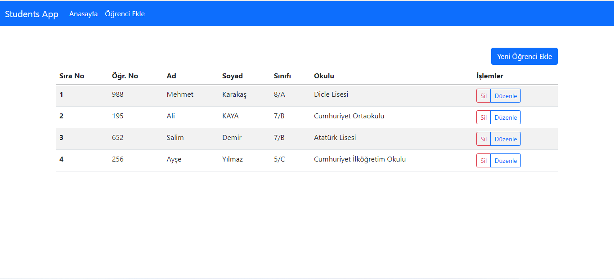
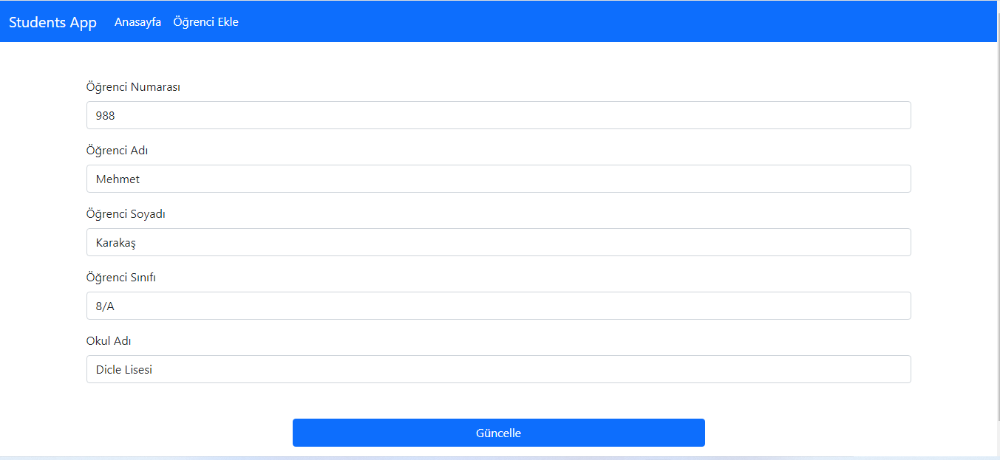

### REACT-ROUTER-DOM İLE OKUL KAYIT UYGULAMASI

## Bu projenin react-route-dom, axios, useEffect, Navigate ve Lifecycle özelliklerinden faydalanılmıştır. 

## İlk resmimizde projemizin anasayfasını görüyoruz. Burada öğrenci bilgilerini giriyoruz. Öğrenci bilgilerinde hata olursa veya inputlar boş bırakılıp kaydet butonuna basılırsa alert ile uyarı veriliyor.

## İkinci resmimizde öğrenci ekle sekmesindeyiz. Bu bölümde öğrenci bilgilerini düzenleyip veya kaydı silinen öğrencileri silebiliyoruz. Düzenle butonuna tıkladığımızda sistem bizi yeniden anasayfaya yönlendirip düzenlemek istediğimiz öğrenci bilgileri güncellenecektir. Bu güncelleme ve düzenleme axios aracılığıyla serverımızdan da yapılmaktadır.

## Üçüncü resmimizde ise güncellemek istediğimiz öğrencinin düzenle butonuna tıkladığımız için sistem bizi anasayfaya yönlendirdi. Güncellemeler axios aracılığıyla serverımızdan da gerçekleşecektir.

